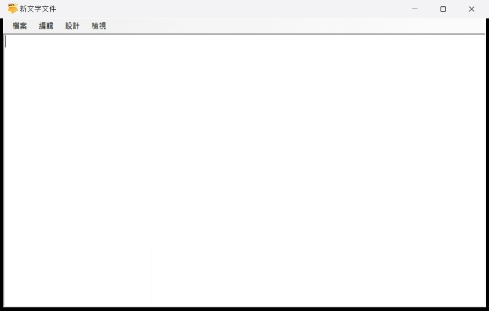
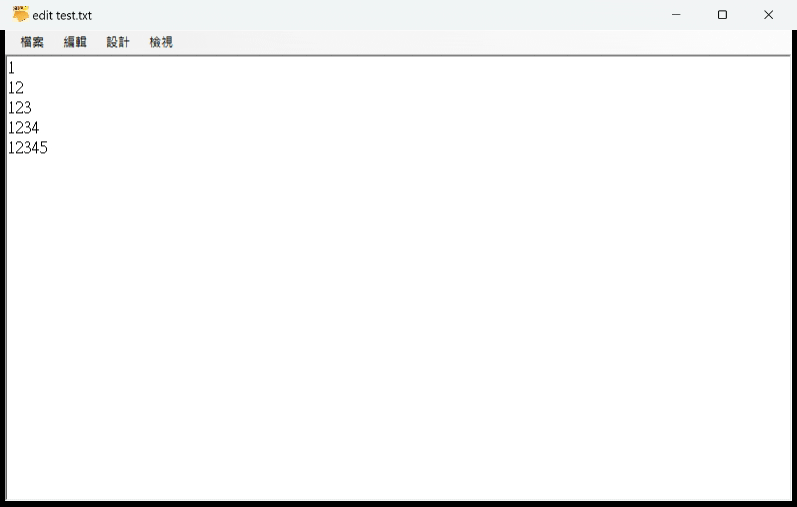
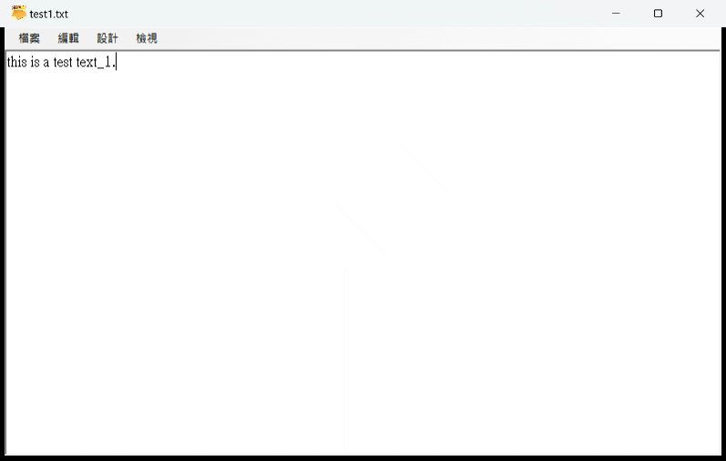
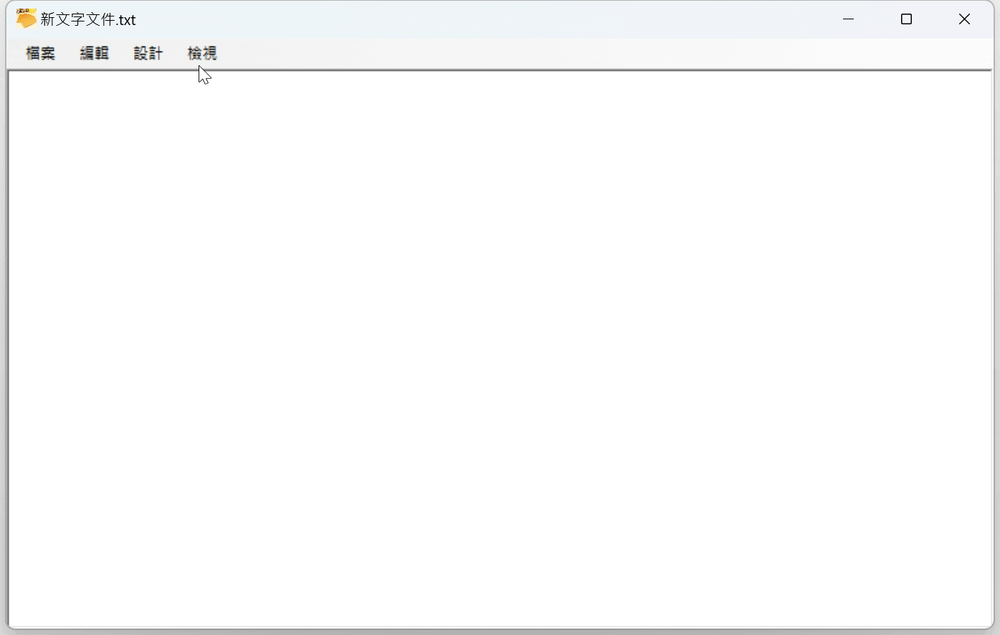

# NotePad_Test

-程式功能
	-檔案:開啟新檔，開啟舊檔，儲存檔案，另存新檔，列印，預覽列印，版面設定，結束
 	

 	-編輯:復原，重做，剪下，複製，貼上，刪除，全選，時間/日期(輸出時間在文件上)
    	

	-設計:字形(全部/部分)，顏色(全部/部分)，自動換行
      	

       	-檢視:狀態列(包含目前動態時間，目前行列數)
 	

-運行方式:開啟檔案後，依使用者的決定來文件讀寫。

	 若有修改文件尚未儲存則關閉，會詢問是否要儲存。

	 並可以執行列印等相關功能。

	 基本的復原，重做，剪下，複製，貼上，刪除，全選功能。

	 字形顏色的修改。

	 狀態列顯示目前時間和目前游標所指行數。

